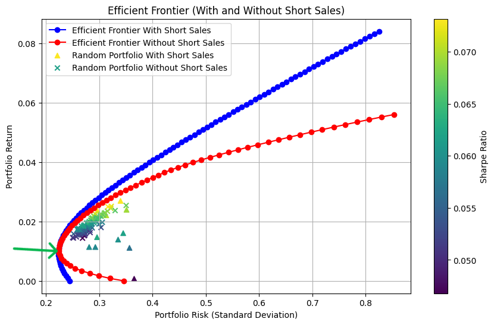

# GR5398 FinGPT Assignment1 Instruction

## 0. Targets

In assignment 1, we want you to:

+ Run **[FinRL-Trading](https://github.com/AI4Finance-Foundation/FinRL-Trading)** to get a basic understanding of what you will do in this semester.
+ Design a portfolio using the selected stocks, and learn some fundamental information of quantitative trading (especially stock selection part).
+ Summarize your result in a very brief research report. Submit your codes onto GitHub repo in a new folder called `Assignment1_Name_CUID`.

Assignment 1 Report Submission Due Day: Oct 5th, 2025.

## 1. Run FinRL-Trading

### 1.1 Using Machine Learning to select stocks

In this part, you should fully understand what we have done, and reproduce this research, especially the stock selection section for beginners.

To achieve this goal, you should focus on folder *[data_processor](https://github.com/AI4Finance-Foundation/FinRL-Trading/tree/master/data_processor)* first to get the useful fundamental data for stocks. 

+ Note: Here we highly recommend you to register for a WRDS account which our university has provided for all master students for free. Please follow the instruction below to get a WRDS account:
  + https://guides.library.columbia.edu/wrds

After this is done, you should get a folder with a *final_ratios.csv* and fundamental ratios by stocks' industry sector. Then, you should use Machine Learning to select stocks using those fundamental data to determine what stocks should we hold for every quarter. You can directly run `stock_selection.py` to use ML to select stocks.

+ Reminder: After our experiments, we found that you should manually change the label for stocks from "gvkey" to "tic" in  *stock_selection.py* since there were some overlaps among different stocks that used the same gvkey during the same period.

### Optional: Using Deep Reinforcement Learning to select stocks

Apart from Machine Learning methods, you can also try Deep Reinforcement Learning to select stocks by running `fundamental_portfolio_drl.py`. We highly recommend you to use GPU(s) to implement this.

### 1.2 Outputs of stock selection

You should have a file called ***stock_selected.csv*** which contains the stocks you selected for every quarter. The content should be like this:

| tic  | predicted_return   | trade_date |
| ---- | ------------------ | ---------- |
| COP  | 0.0146875288337469 | 2001-03-01 |
| APC  | 0.0251015825683922 | 2001-06-01 |
| ...  | ...                | ...        |
| WY   | 0.0006114667630754 | 2025-09-01 |

## 2. Build a Portfolio

### 2.1 Build a Minimum Variance Portfolio

After you get the selected stocks for every quarter, you should design a way to allocate your capital and build a portfolio. The easiest way to build a portfolio is to give each component stock an equal weight. However, we have already tried for this, and it didn't work very well (we also highly recommend you to try by yourself).

Thus, your main task is to build a **Minimum Variance Portfolio (MVP)** like the portfolio below **(you are NOT allowed to use short sales)**:



+ Reminder: you can use `minimize` in `scipy` to calculate this MVP.

  ```python
  from scipy.optimize import minimize
  ```

  

### 2.2 Output of your portfolio

You should generate a csv file with information below:

| trade_date | tic  | weights              |
| ---------- | ---- | -------------------- |
| 2001-03-01 | APA  | 0.004807692307692308 |
| 2001-03-02 | APA  | 0.004807692307692308 |
| ...        | ...  | ...                  |
| 2001-05-31 | APA  | 0.004807692307692308 |
| ...        | ...  | ...                  |

**You should submit your csv file and your code (best in Python) that helps you design this MVP.**

## 3. Portfolio Trading Backtest

We will provide you with backtest code so you can check your portfolio's performance on historical data. This code will generate a portfolio market value chart and the strategy's performance metrics. In the code, the whole portfolio will only trade on "trade_date" according to your portfolio. And during the holding period, there will be no trades. You can also try other strategies and trading signals if you are interested. Here is an example of the results:


```
Cumulative Return: 1326.15%
Annual Return: 13.55%
Max Drawdown: -28.78%
Annual Volatility: 16.92%
Sharpe Ratio: 0.8361
Win Rate: 54.58%
Information Ratio: 0.3078
```

**You should add your portfolio value chart and these performance measurement metrics into your report.**

## 4. Research Report for Assignment 1

Since you have to submit a research report as final evaluation of your performance in this course, here we highly recommend you to submit all your codes and files onto GitHub while putting all your charts and measurement results into your report.

Your report for assignment 1 should include:

+ Core code of your MVP calculation
+ Portfolio trading backtest results
+ **Optional**: DRL stock selection results, your own trading strategies and their results
