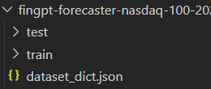
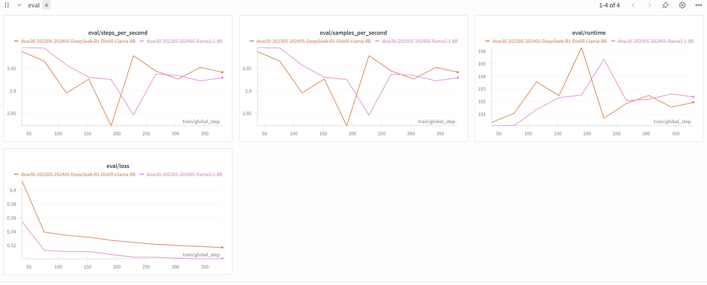

# GR5398 FinGPT Assignment2 Instruction

## 0. Targets

+ In this assignment, we would like you to run a whole pipeline of [FinGPT-Forecaster](https://github.com/AI4Finance-Foundation/FinGPT/tree/master/fingpt/FinGPT_Forecaster) to combine Large Language Models with real-world financial market.
+ You will use **Lo**w-**R**ank **A**daptation (**LoRA**) to **P**arameter-**E**fficient **F**ine-**T**uning (**PEFT**) some mainstream LLMs.
+ Analyze and optimize your fine-tuned LLMs using some methods (especially Human-in-the-Loop, **HITL**).
+ Summarize your result in a very brief research report. Submit your codes onto GitHub repo in a new folder called `Assignment2_Name_UNI` (not a new branch!).

> [!WARNING]  
> ⚠️ **DO NOT SUBMIT YOUR OWN API KEY ONTO GITHUB!!!**

Assignment 2 Report Submission Due Day: Nov 7th, 2025.

## 1. Prerequisites

In this assignment, you are asked to:

+ Use Finnhub API and ChatGPT API to get train samples (If you choose to generate sample data by yourself)
+ Download base model from HuggingFace
+ Fine-tune some LLMs on GPU(s)

Therefore, you should have the following resources:

+ [Finnhub](https://finnhub.io/): You should register for an API key which can provide you with stock daily news data (If you choose to generate sample data by yourself).
+ [ChatGPT-API](https://openai.com/api/): You should register for an API key and buy some tokens for generating train samples (If you choose to generate sample data by yourself).
+ [Hugging Face](https://huggingface.co/): You should register for an account so that you can download some base models later.
+ GPU resource: You can go to Google Colab (highly recommended) or other websites to buy some GPU resources for later fine-tuning.
+ [Wandb](https://wandb.ai/site): You can register for an account, and this website can help you trace your GPU's performance (e.g. train loss, eval loss, GPU temperature...)

## 2. Low-Rank Adaptation

Large language models (LLMs) contain billions of parameters, making full fine-tuning computationally expensive and memory-intensive. **Low-Rank Adaptation (LoRA)** was proposed as an efficient alternative to traditional fine-tuning by **introducing trainable low-rank matrices** into the model’s weight updates, while **freezing the original pretrained weights**. This approach significantly reduces the number of trainable parameters and the associated GPU memory footprint.

Mathematically, we can split the original model (here we use **Transformer** as an example) into several blocks which include Self-Attention Layer and Feed-Forward Layer.

```yaml
      ┌─────────────────────┐
      │ Transformer Block   │
      │                     │
      │  ┌───────────────┐  │
      │  │ Self-Attention│  │
      │  │   Q: X W_Q    │  │
      │  │   K: X W_K    │  │
      │  │   V: X W_V    │  │
      │  │   O: A W_O    │  │
      │  └───────────────┘  │
      │                     │
      │  ┌───────────────┐  │
      │  │ Feed Forward  │  │
      │  │  W1, W2       │  │
      │  └───────────────┘  │
      └─────────────────────┘

```

Commonly, when we are doing LoRA, we want to fine-tune the pre-trained weight matrices $W_0\in\mathbb{R}^{d \times k}$. However, instead of directly updating these matrices, we add an additional low-rank matrix just behind each weight matrices, and we only train these additional matrices:
$$
\Delta W = B A,\\
W = W_0 + \alpha \cdot B A = W_0 + \alpha \Delta W, \\
A \in \mathbb{R}^{r \times k}, B \in \mathbb{R}^{d \times r}, \text{where }r << min(d, k)
$$
and $\alpha$ is a scaling factor controlling the magnitude of the update.

+ Self-Attention Layer:

  In each self-attention layers, we calculate:
  $$
  \begin{aligned}
  Q &= X W_Q, \\
  K &= X W_K, \\
  V &= X W_V, \\
  \text{Attention}(Q, K, V) &= \mathrm{softmax}\!\left( \frac{Q K^{\top}}{\sqrt{d_k}} \right) V\\
  \text{Output} &= \text{Attention}(Q, K, V)W_O
  \end{aligned}
  $$
  Here we have 4 pre-trained weight matrices $W_Q$, $W_K$, $W_V$, $W_O$, where we most likely to insert additional matrices.

+ Feed-Forward Layer:

  In feed-forward layers, we calculate:
  $$
  FFN(x)=\sigma(xW_1+b_1)W_2+b_2,
  $$
  where we get 2 pre-trained weight matrices $W_1$ and $W_2$ that we can insert additional matrices into.

To implement this, you should understand the whole pipeline:

```
Dataset → Tokenizer → DataCollator → Model(with LoRA Adapter)
             │                     │
             └──────→ Trainer ←────┘
                             │
                TrainingArguments + Callbacks
                             │
                     TensorBoard / Checkpoint

```

and import these Python libraries:

```python
# Log training metrics to TensorBoard for visualization
from transformers.integrations import TensorBoardCallback

# Load pretrained tokenizer and model automatically
from transformers import AutoTokenizer, AutoModel, AutoModelForCausalLM  

# Define training settings and handle training loop
from transformers import TrainingArguments, Trainer, DataCollatorForSeq2Seq  

# Customize training behavior and monitor training state
from transformers import TrainerCallback, TrainerState, TrainerControl  

# Default filename for saving training arguments
from transformers.trainer import TRAINING_ARGS_NAME  

# Load or merge LoRA/PEFT adapter weights with a pretrained model
from peft import PeftModel  
```

## 3. FinGPT Fine-Tuning Pipeline Overview

In this task, we want you to train your own FinGPT model using **Dow Jones 30** stocks data. Please refer to [FinGPT-Forecaster](https://github.com/AI4Finance-Foundation/FinGPT/tree/master/fingpt/FinGPT_Forecaster) for all the source code files.

### 3.1 Get Sample Data

This step prepares and validates your dataset before LoRA fine-tuning.

Here we provide you with [Dow Jones 30 stock prompts](https://huggingface.co/datasets/FinGPT/fingpt-forecaster-dow30-202305-202405) from May 2023- May 2024, and you can directly use these prompts to fine-tune your own model.

#### Optional: Generate sample dataset by yourself

However, we would also like you to generate some sample data by yourself, for example, **NASDAQ 100**.

To do this, you should first search for Nasdaq 100 components tickers, and add them to `indices.py` as a list. Then you should add your reference of Nasdaq 100 component list into `main()` function in `data_pipeline.py`. Also, you should put all your API keys into those related Python files or into a `.env` file so that the program can use them. It should be like this:

```python
os.environ['FINNHUB_KEY'] = "your_real_api_key_here"
os.environ['OPENAI_KEY'] = "your_real_api_key_here"
......

finnhub_client = finnhub.Client(api_key=os.environ.get("FINNHUB_KEY"))
client = OpenAI(api_key=os.environ.get("OPENAI_KEY"))
......
```

or:

```
### Remember no quotion marks in this file!!!
FINNHUB_KEY=your_real_api_key_here
OPENAI_KEY=your_real_api_key_here
......
```

and use them in your Python file:

```python
import os
from dotenv import load_dotenv

load_dotenv()

finnhub_client = finnhub.Client(api_key=os.environ.get("FINNHUB_KEY"))
client = OpenAI(api_key=os.environ.get("OPENAI_KEY"))
......
```

> [!WARNING]  
> ⚠️ **DO NOT SUBMIT YOUR OWN API KEY ONTO GITHUB!!!**

Then you can run `data_pipeline.py` to generate your train and test prompts datasets.

In this step, you should get a folder called `fingpt-forecaster-dow30(or nasdaq100)-xxxxxx` that contains your prompt and ChatGPT's standard answer, and these data should have been already split into train and test dataset.



Also, to check if you have generated correct form of prompts, here is an example of the prompt:

```
SYSTEM_PROMPT = "You are a seasoned stock market analyst. Your task is to list the positive developments and potential concerns for companies based on relevant news and basic financials from the past weeks, then provide an analysis and prediction for the companies' stock price movement for the upcoming week. Your answer format should be as follows:\n\n[Positive Developments]:\n1. ...\n\n[Potential Concerns]:\n1. ...\n\n[Prediction & Analysis]:\n...\n"

prompt = """
[Company Introduction]:

{name} is a leading entity in the {finnhubIndustry} sector. Incorporated and publicly traded since {ipo}, the company has established its reputation as one of the key players in the market. As of today, {name} has a market capitalization of {marketCapitalization:.2f} in {currency}, with {shareOutstanding:.2f} shares outstanding. {name} operates primarily in the {country}, trading under the ticker {ticker} on the {exchange}. As a dominant force in the {finnhubIndustry} space, the company continues to innovate and drive progress within the industry.

From {startDate} to {endDate}, {name}'s stock price {increase/decrease} from {startPrice} to {endPrice}. Company news during this period are listed below:

[Headline]: ...
[Summary]: ...

[Headline]: ...
[Summary]: ...

Some recent basic financials of {name}, reported at {date}, are presented below:

[Basic Financials]:
{attr1}: {value1}
{attr2}: {value2}
...

Based on all the information before {curday}, let's first analyze the positive developments and potential concerns for {symbol}. Come up with 2-4 most important factors respectively and keep them concise. Most factors should be inferred from company-related news. Then make your prediction of the {symbol} stock price movement for next week ({period}). Provide a summary analysis to support your prediction.

"""
```

The answer should be like:

```
Positive Developments:
1. **Strategic Partnerships & AI Integration**: CrowdStrike announced a partnership with AWS and Google Cloud to enhance AI-native cybersecurity solutions, positioning it as a critical player in AI-driven security. This aligns with growing demand for AI-powered cybersecurity tools, as highlighted in multiple bullish articles.
2. **Product Innovation & Leadership Recognition**: Recent awards (e.g., KuppingerCole Leadership Compass) and product launches (e.g., Falcon Next-Gen SIEM ISV Ecosystem) reinforce CrowdStrike’s competitive edge in endpoint detection and incident response.
3. **Growth & Market Positioning**: Analysts and media consistently highlight CrowdStrike as a top-performing growth stock, with a high P/E ratio (540) reflecting investor optimism. Its strong free cash flow margin (35%) and net margins (4.65%) suggest sustainable profitability.

Potential Concerns:
1. **Valuation Risks**: Elevated multiples (P/S: 21.66, P/E: 540) leave room for downside if growth expectations falter or broader market sentiment shifts.
2. **Debt & Liquidity Pressures**: High current ratio (1.8) and negative net debt (-116.7%) indicate reliance on cash and liquidity, which could become a concern if margins shrink or investments fail to yield returns.
3. **Sector Volatility**: Cybersecurity stocks are notoriously cyclical, and recent news about Amazon’s security spending shifts (replacing other tools with CrowdStrike) may not fully offset competitive pressures or market volatility.

Prediction: **Up by more than 5%**
CrowdStrike’s stock is poised for a **5%+ rise** in the upcoming week. The company’s strategic partnerships, AI-driven product advancements, and high valuation metrics (P/E, P/S) will likely sustain bullish momentum. The recent surge (+3.2% from May 5–12) signals accumulation by institutional investors, while the AWS and Google Cloud partnerships could drive renewed investor optimism around its AI-native security solutions. However, valuation risks and sector-specific volatility may limit upside, so the prediction is conservative but reflects strong near-term sentiment.
```

### 3.2 Fine-tune LLMs

In this step, we want you to fine-tune some LLMs, to be specific, [Llama-3.1-8B](https://huggingface.co/meta-llama/Llama-3.1-8B) and [DeepSeek-R1-Distill-Llama-8B](https://huggingface.co/deepseek-ai/DeepSeek-R1-Distill-Llama-8B). And you should run `train_lora.py` using command in `train.sh` in this part.

First, you should put your HuggingFace token into your code and download these two pre-trained models into a cache folder:

```python
model = AutoModelForCausalLM.from_pretrained(
    model_name, ### E.g. "meta-llama/Llama-3.1-8B"
    load_in_8bit=True, ### Reduce the usage of VRAM
    trust_remote_code=True,
    device_map=None,
    cache_dir=cache_dir, ### Best if defined by yourself, or it will be download in C:\
    torch_dtype=torch.bfloat16 ### Choose by your VRAM
)
```

Then, you should load tokenizer of this specific model:

```python
tokenizer = AutoTokenizer.from_pretrained(
    model_name, 
    trust_remote_code=True, 
    cache_dir=cache_dir,
)
tokenizer.pad_token = tokenizer.eos_token ### Use End Of Sentence token to do padding
tokenizer.padding_side = "right" ### Pad at right side, e.g. [Hello, world, <PAD>, <PAD>]
```

You should load your dataset by (similarly if you want to use your own dataset):

```python
### If you use Dow Jones 30 dataset on Hugging Face
dataset_fname = "./data/" + args.dataset
dataset_list = load_dataset(dataset_fname, args.from_remote)
```

Here is the core part of PEFT:

```python
# Define how LoRA adapters will be injected into the base model
peft_config = LoraConfig(
    task_type=TaskType.CAUSAL_LM,     # Causal Language Modeling task (left-to-right text generation)
    inference_mode=False,
    r=8,
    lora_alpha=16,                    # Scaling factor that controls update strength
    lora_dropout=0.1,                 # Dropout rate applied to LoRA layers (improves generalization)
    
    # Target modules where LoRA adapters will be injected.
    # These correspond to key linear projection layers inside Transformer blocks.
    target_modules=[
        'q_proj', 'k_proj', 'v_proj',     # Query, Key, Value projections in attention layers
        'o_proj',                         # Output projection in attention
        'gate_proj', 'up_proj', 'down_proj',  # Feed-forward layers
        # 'embed_tokens', 'lm_head',       # Optional: include embeddings or output head (not needed usually)
    ],
    bias='none',                       # Do not add bias parameters in LoRA layers
)

# Wrap the original model with LoRA adapters
model = get_peft_model(model, peft_config)

# Print how many parameters are trainable (should be much smaller than full model)
model.print_trainable_parameters()
```

> [!note]
>
> - This section represents the **core component of the PEFT framework**.  
>
> - It **defines the LoRA configuration and injects adapter layers** into the pretrained model.  
> - It ensures that **only the LoRA adapter parameters are trainable**, while all original model weights remain frozen.

After modified these parts above in `train_lora.py`, you can start you training using **deepspeed** by running `train.sh` (Windows system):

```shell
deepspeed \
    --include localhost:2,3 \
    train_lora.py \
    --run_name name_you_like \
    --base_model llama2 \
    --dataset your_own_dataset \
    --max_length 4096 \ ### Choose by your VRAM
    --batch_size 1 \ ### Choose by your VRAM
    --gradient_accumulation_steps 16 \
    --learning_rate 5e-5 \
    --num_epochs 5 \
    --log_interval 10 \
    --warmup_ratio 0.03 \
    --scheduler constant \
    --evaluation_strategy steps \
    --ds_config config.json
```

However, the command itself may be slightly different if you use different computer systems. For example, you should use this if you are using Linux system:

```shell
ds \ ### Difference
    --include localhost:0 \
    train_lora.py \
    --run_name name_you_like \
    --base_model llama2 \
    --dataset your_own_dataset \
    --max_length 4096 \
    --batch_size 1 \
    --gradient_accumulation_steps 16 \
    --learning_rate 5e-5 \
    --num_epochs 1 \
    --log_interval 10 \
    --warmup_ratio 0.03 \
    --scheduler constant \
    --evaluation_strategy steps \
    --ds_config config.json
```

Here are some recommended hyperparameters for LoRA Fine-Tuning:

| Parameter                     | Recommended Range      | Description                                                  |
| ----------------------------- | ---------------------- | ------------------------------------------------------------ |
| `learning_rate`               | 1e-4 – 5e-5            | Learning rate for LoRA adapters; smaller values ensure stable convergence. |
| `num_train_epochs`            | 1 – 5                  | Total number of training epochs depending on GPU time and dataset size. |
| `r`                           | 8 – 16                 | LoRA rank (number of low-rank dimensions); higher values capture more task-specific information. |
| `lora_alpha`                  | 16 – 32                | Scaling factor that controls the strength of LoRA updates.   |
| `target_modules`              | `q_proj`, `v_proj`     | Common target layers in Transformer blocks for LoRA injection. |
| `max_length`                  | 2048 – 4096            | Maximum sequence length; adjust based on GPU memory.         |
| `batch_size`                  | 1 – 4                  | Training batch size per device; smaller values for limited VRAM. |
| `gradient_accumulation_steps` | 8 – 32                 | Accumulate gradients to simulate larger effective batch size. |
| `torch_dtype`                 | `float16` / `bfloat16` | Mixed-precision type to balance memory efficiency and stability. |
| `load_in_8bit`                | `True` / `False`       | Enable 8-bit quantization to reduce GPU memory usage.        |

> [!TIP]  
> You may need to tune `max_length`, `batch_size`, and `gradient_accumulation_steps` dynamically based on your available VRAM (e.g., 8 GB vs. 24 GB GPUs).

After done all these, you can see that your models are being trained on GPUs by Wandb:



### 3.3 Evaluate your model

Now you get 2 fine-tuned model based on Llama3 and DeepSeek. You can try for generating some interesting answer using your own model. 

However, in your report, you should compare the answers from your model and the teacher models quantitatively. The evaluation metrics are listed below:

| Metric                       | Formula / Type                              | Description                                                  |
| ---------------------------- | ------------------------------------------- | ------------------------------------------------------------ |
| **Binary Accuracy**          | `(correct_predictions / total_predictions)` | Measures the proportion of correctly predicted binary outcomes (e.g., “up” or “down” stock movement). |
| **Mean Squared Error (MSE)** | `MSE = (1/n) * Σ(y_pred - y_true)²`         | Quantifies average squared difference between predicted and true numerical values. Lower is better. |
| **Rouge-1**                  | N-gram overlap (1-gram)                     | Evaluates word-level overlap between model output and reference text; measures recall. |
| **Rouge-2**                  | N-gram overlap (2-gram)                     | Measures bigram-level overlap, reflecting fluency and contextual accuracy. |
| **Rouge-L**                  | Longest Common Subsequence                  | Captures overall structural similarity between predicted and reference text. |
| **Inference Time (s)**       | Time per sample                             | Average time taken by the fine-tuned model to generate one response; reflects runtime efficiency. |

> [!NOTE]  
> You can use the provided `calc_metrics()` function in `utils.py` or run `comparison.py` to automatically compute these metrics across all generated outputs.

Here is a brief example of quantitative analysis using `calc_metrics()`:

```
Binary Accuracy: 0.29  |  Mean Square Error: 4.64

Rouge Score of Positive Developments: {'rouge1': 0.4202282600542612, 'rouge2': 0.14931479501035597, 'rougeL': 0.2578559230218219}

Rouge Score of Potential Concerns: {'rouge1': 0.40652271907403026, 'rouge2': 0.13952370414379708, 'rougeL': 0.2513779865861211}

Rouge Score of Summary Analysis: {'rouge1': 0.4178582895911193, 'rouge2': 0.11082203617356211, 'rougeL': 0.2031596404349372}
```

You can directly run `comparison.py` in `Assignment2/source_code` to do this comparison.

## 4. Research Report for Assignment 2

Your report should focus on these following parts:

+ Hardware (GPU model: e.g. NVIDIA GeForce RTX 4060, CUDA version: 12.6) and computer system (Windows/MacOS/Linux) you used for training 
+ How did you set up your training environment
+ Brief analysis of the Dow30 dataset
+ How did you fine-tuned your models
+ Evaluation metrics results
+ **Optional**: How did you generate new dataset

Especially, in evaluation parts, you should talk about:

+ Inference time cost
+ Accuracy of execution
+ Depth of analysis in comparing the models (Subjective Analysis)
+ Clarity and professionalism in reporting (Subjective Analysis)

For specific report example, you can refer to [my blog on medium](https://medium.com/@SkylineYang/applying-new-llm-models-on-fingpt-fine-tune-deepseek-and-llama3-6ac9198d88b2).
