# GR5398 FinGPT Assignment3 (Optional) Instruction

## 0. Targets

In this assignment, we want to let you learn:

+ how to apply LLMs on quantitative researches
+ whole process on designing a quantitative trading strategy

Assignment 3 Report Submission Due Day: Dec 12th, 2025.

> [!Important]
>
> Final Report of course GR5398 should be sent to Professor Demissie Alemayehu before Dec 12th, 2025!

## 1. How to apply LLMs on quantitative researches?

Nowadays, as the widely usage of LLMs in every field, researchers in quantitative finance also want to take advantage of this high-efficiency and smart tool. In real world, there are two main methods of applying LLMs on quantitative researches:

### 1.1 Use LLMs to reproduce strategies

One way to apply LLMs into the whole quantitative strategy researching is to use them as human quantitative researchers. Since these LLMs can perfectly understand user's instruction and give their "own" solutions in a very short time, now quantitative researchers can use them to automatically reproduce existed strategies published on research reports by other securities traders or researchers. The only thing user needs to do is to provide the LLMs with a concept, and they will give you back with robust and beautiful backtest codes and results (if you design your **prompt** or your Multi-Agent System **structure** properly). Here is a flow chart to tell you how to use LLMs to reproduce strategies.

```mermaid
flowchart LR
    A[Define Research Scope\n• Markets, asset classes\n• Time period, data sources] --> B[Collect Existing Work\n• Academic papers\n• Sell-side reports\n• Internal research notes]

    B --> C[LLM: Ingest & Organize\n• Chunk documents\n• Tag by asset, style, horizon]

    C --> D[LLM: Extract Factor Ideas\n• Formal factor definitions\n• Signal construction rules\n• Assumptions & regimes]

    D --> E[LLM: Generate Implementations\n• Pseudo-code\n• Python / SQL templates\n• Backtest config skeletons]

    E --> F[QR Review & Hardening\n• Clean code\n• Add proper data handling\n• Add risk/transaction cost models]

    F --> G[LLM: Batch Backtesting\n• Run across symbols\n• Vary parameter grids\n• Store full PnL & factor stats]

    G --> H[LLM + QR: Analyze Results\n• Rank factors \n• Detect overfitting patterns\n• Propose refinements]

    H --> I[Decision\n• Keep promising factors\n• Modify weak ones\n• Discard noisy/unstable ideas]

    I --> J[Production Factor Library\n• Versioned code\n• Metadata & docs\n• Monitoring rules]

    J --> K[Continuous Loop\n• New papers & data\n• LLM re-runs extraction\n• Auto-check drifts / breaks]

```

To implement this, you should design a Multi-Agent System with some agents to do different jobs. For example, you should design a report reader agent, a code writer agent, a backtest agent and so on. But this technology doesn't require you of training or fine-tuning a LLM on a hardware. To "fine-tune" this system, you need to design the information flow (especially prompts) properly.

> [!Note]
>
> A **Multi-Agent System (MAS)** is a framework where multiple independent software agents work together to solve a complex task. Each agent is a small program or model with its own goal, knowledge, and behavior. Agents communicate with each other, share information, and coordinate actions—similar to a team of specialists.

### 1.2 Use LLMs to generate trading signals/effective factors

Beyond “thinking and acting” like a human analyst, Large Language Models (LLMs) are also powerful text feature extractors. In particular, they are very good at **sentiment analysis**, **event classification**, and **information extraction**, which makes them natural tools for building **news-driven trading signals**.

In this assignment, we will build a simple pipeline:

1. **Collect news data** for a universe of assets (e.g., stocks or ETFs).
2. **Feed the raw news into an LLM** to obtain structured outputs (scores, tags, summaries).
3. **Convert LLM outputs into numerical factors** aligned with timestamps and tickers.
4. **Use these factors to construct and backtest trading signals**.

Below is a more detailed flowchart.

```mermaid
flowchart LR
    A[News Sources<br/>• Websites / APIs] --> B[Data Collection<br/>• Python spider / API client]
    B --> C[Raw News Database<br/>• timestamp, ticker, headline, text]
    C --> D[LLM Analysis<br/>• sentiment, relevance, event type]
    D --> E[Structured LLM Output<br/>• JSON with sentiment/relevance scores]
    E --> F[Factor Construction<br/>• aggregate & normalize by ticker/date]
    F --> G[Trading Signal Design<br/>• rules: long/short based on factors]
    G --> H[Backtesting & Evaluation<br/>• PnL, Sharpe, IC, drawdown]
    H --> I[Iterate & Refine<br/>• tune prompts, features, and rules]
```

## 2. Suggested steps of applying LLMs on quantitative strategies

In this assignment 3, we want you to learn and realize a way to use LLMs in generating trading signals based on your previous work on assignment 1 & 2. You should use FinRL as stock selection strategy, and use FinGPT as timing strategy. To be specific, below are some suggested steps on doing this:

1. You should first decide which index you want to use to **select stocks** from its component stocks similarly as you did in assignment 1;
2. Use some APIs (e.g. Finnhub) or python spider to **get related news** of these stocks;
3. Use FinGPT models you got in assignment 2 to get its prediction of future returns and some pros & cons;
4. You can directly use the predicted returns to **generate signals**, or you can use another LLM to get a sentiment score and then generate signals;
5. Use your trading signal to do the **backtest**.

Here, we suggest you to set the backtest period to the last whole year (Dec 2024 - Nov 2025), but longer period is also welcomed. The target of your strategy's performance is to **beat S&P 500 index**.

## 3. Research Report for Assignment 3

In your report, we want to see:

+ How you apply LLMs into your quantitative strategy
+ Your strategy's performance
+ (Optional) comparison of the performance of your original strategy in assignment 1 with new strategy's performance

## 4. Final Report of GR5398

This report is basically a summary of what you did in this course, so you can simply conclude all these 3 assignments and concatenate your 3 reports to show what you have learnt and achieved in this semester.
